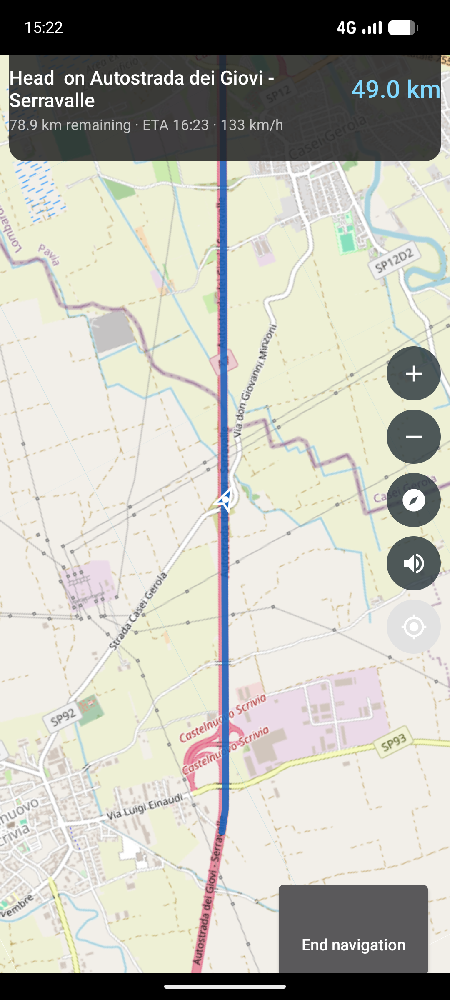
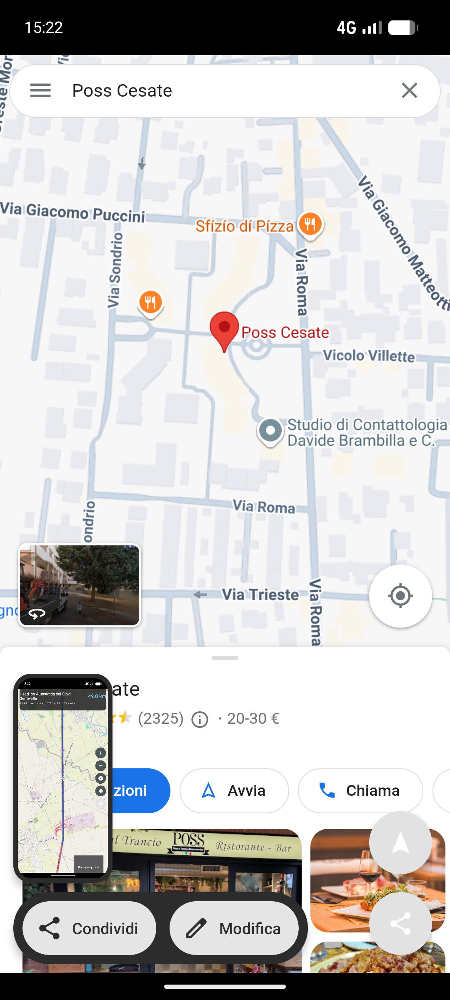

GMaps WV Nav
============

GMaps WV Nav is an improved fork of the [DivestOS GMaps WV](https://github.com/Divested-Mobile/Maps)
WebView wrapper for using Google Maps without exposing your device, with
**in-app turn-by-turn navigation** and easy place sharing added.

Features
--------
- Clears private data on close
- Blocks access to Google trackers and other third-party resources
- Restricts all network requests to HTTPS
- Allows toggling of location permission
- **In-app turn-by-turn navigation** (no navigation app required):
  - Floating "Navigate" button opens the built-in `NavigationActivity` with the
    current place/coordinates as the destination
  - Route is calculated with the public OSRM demo server and drawn on an
    OpenStreetMap (Leaflet) map
  - Step-by-step guidance: next-maneuver distance, remaining distance, ETA and
    speed, with spoken announcements (TTS) and vibration at each maneuver
  - The destination can be an address (geocoded via Nominatim) or coordinates
  - Intercepts `google.navigation:` links fired by the maps page itself and
    hands them to the Google Maps app when present, otherwise navigates in-app
- **Easy place sharing**:
  - Floating "Share" button shares the current place as a link
    (`https://www.google.com/maps/search/?api=1&query=lat,lng`)
  - Copying a maps link or coordinates (e.g. from the in-page Share button)
    pops up quick actions: Share / Navigate / Copy
  - The app accepts `ACTION_SEND` text/links and `geo:` / maps URLs from other apps

Build
-----
The APK is built automatically by GitHub Actions and uploaded as an artifact:

- On every push to `main` / `master` and via "Run workflow" (`workflow_dispatch`)
- On tag pushes (`v*`) a GitHub Release with the signed release APK is created

To build locally:

    ./gradlew assembleRelease

Screenshots
-----------

Downsides
---------
- The in-app navigation uses the public OSRM demo server
  (`router.project-osrm.org`), which is rate-limited; for heavy use consider
  pointing it at a self-hosted OSRM instance
- WebRTC isn't blocked due to WebView limitations
- Cache isn't cleared due to resource/data considerations, however could allow
  tracking without other data (cookies)
  - Manually clear app cache if necessary

Credits
-------
- @woheller69 for discovering that page loaded resources weren't being blocked
- @woheller69 for adding proper location support
- @woheller69 for adding location sharing to other map apps
- @woheller69 for disabling WebView telemetry
- R Raj for the sharing intent support
- Icons: Google/Android/AOSP, License: Apache 2.0, https://google.github.io/material-design-icons/
- Divested Computing Group for the original project

License
-------
GNU AGPL-3.0, see [LICENSE](LICENSE).
